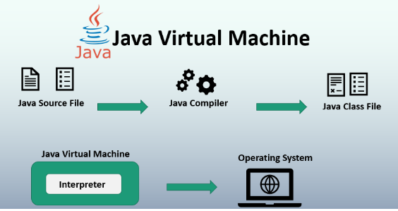
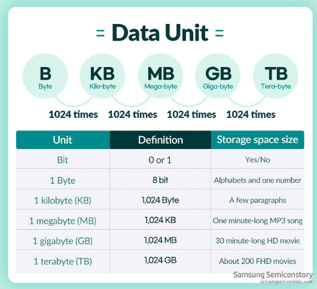

# Java

---
1. 객체 지향 프로그래밍(OOP) : 순수 객체 지향 언어이다. 모든 것이 객체로 표현되며 클래스를 통해 상속, 캡슐화, 다형성 등의 OOP 원칙을 지원한다
   1. 두 가지 특성을 공유함. 상태 / 동작 이 있다. 예를들어 개(Dog)라는 객체에는 상태(이름, 색깔, 품종) 와 동작(짖기, 가져오기, 꼬리 흔들기)이 있다.
   2. 소프트웨어 개체는 개념적으로 실제 개체와 유사하다. 자신의 상태를 필드에 저장하고 메소드를 통해 동작을 노출한다.
   3. 모듈성, 정보 숨기기, 코드 재사용, 연결 및 디버깅 용이성 등의 장점이 있음.
2. 간결함
3. 멀티스레드
4. 강력한 표준 라이브러리
5. 보안
6. 동적
7. 강타입 언어


## Java의 실행

---
`Java Virtual Machine` [출처]()


1. Java 프로그램 실행의 시작점은 `main`메서드. 이 메서드는 Java 프로그램이 시작될 때 실행되는 특별한 메서드이다. Java 실행환경(JVM)이 프로그램을 시작할 때 찾는 첫 번째 지점
2. public class Main은 Main 이라는 이름의 클래스를 정의한다.
3. public static void main(String[] args)로 프로그램의 진입점인 main 메서드를 정의한다.

## 변수

---

- 변수와 메모리 구조 간의 관계를 이해하기 위해, 컴퓨터의 메모리와 변수가 프로그램에서 어떻게 사용되는지 알아야 함. 컴퓨터 메모리는 데이터를 저장하는 공간으로, 여러 칸으로 나뉘어 있으며 각 칸은 고유한 주소를 가진다. 변수를 선언할 때, 이 메모리의 특정 부분을 할당받아 변수의 값이 저장될 공간으로 사용된다.
- 변수와 메모리
  - 변수 선언: 변수를 선언하면 해당 변수에 대한 정보(데이터 타입, 변수 이름)가 컴파일러에 의해 처리되고, 실행될 프로그램이 메모리에서 해당 변수를저장할 공간을 확보
  - 데이터 타입 : 변수의 데이터 타입에 따라 필요한 메모리의 크기가 결정. int - 4byte, char - 1byte 등..
  - 메모리 할당 : 변수에 값이 할당되면, 해당 값은 메모리의 할당된 공간에 저장됨. 이 공간의 주소는 변수를 통해 참조될 수 있으며 프로그램이 실행되는 동안 해당 변수를 통해 메모리에 접근하고 값을 읽거나 변경.

- byte?
  - byte는 컴퓨터 메모리의 저장장치에서 데이터를 저장하는 기본 단위. 이진수 0과 1로 표현되는 하나의 bit가 8개 모인것이 byte. 2^8 256가지의 다른 값을 표현할 수 있다.
  

- 기본(원시) 타입(Primitive type)
  - 가장 기본적인 데이터 타입. 정수, 실수, 문자, 불리언 등이 포함됨. 메모리에 고정된 크기로 저장되며, 직접 값을 저장한다.
  - `int`:정수를 저장하는데 사용되며, 일반적으로 4바이트 차지
  - `double`: 실수를 저장하는데 사용되며, 일반적으로 8바이트 차지
  - `char` : 단일 문자 저장하는데 사용, 2바이트
  - `boolean` :  true, false 값만을 가짐. 논리값을 저장하는데 사용

- 참조 타입(Reference type)
  - 메모리의 주소를 저장하는 변수타입, 객체나 배열 등이 속한다. 실제 데이터가 저장된 메모리의 위치를 가리키는 참조값(주소)를 저장한다. 변수를 통해 객체의 속성이나 배열의 요소에 접근할 수 있음.
  - `String` : 문자열을 저장하는 데 사용되며, 문자의 시퀀스를 나타냄.
  - `Array` : 여러 데이터를 연속적으로 저장하는 구조. 같은 타입의 데이터를 순차적으로 관리함.
  - `class` : 사용자가 정의한 복잡한 데이터 타입. 여러 종류의 데이터와 함수를 묶어서 하나의 새로운 타입 생성.

- 데이터 타입을 사용하는 이유
  - 데이터 처이의 정확성을 보장하기위해 - 각 데이터 타입에 맞는 연산을 수행해 오류를 줄임
  - 메모리 사용의 효율성을 높이기 위해 데이터 타입에 따라 필요한 메모리 공간을 할당해 메모리 효율적 사용
  - 프로그램의 가독성을 높이기 위해 데이터의 의도를 명확히 함.


- 변수 선언과 할당
  - Java에서 변수를 선언하고 할당하는 과정을 이해하려면, 변수가 무엇인지와 왜 필요한지 알아야 함.
  - 변수는 데이터를 저장할 수 있는 메모리 공간이며, 프로그램 내에서 데이터를 저장, 변경, 참조
- 변수 선언(Declaration)
  - ```데이터타입 변수이름;``` 형식으로 선언함.